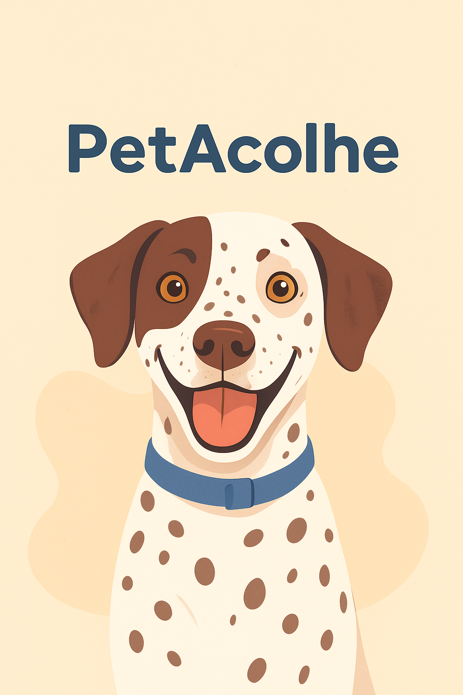
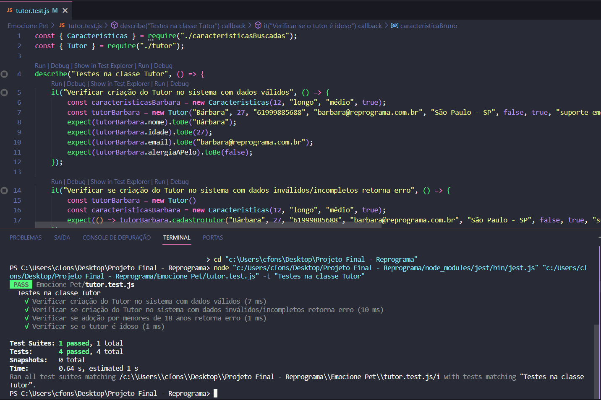
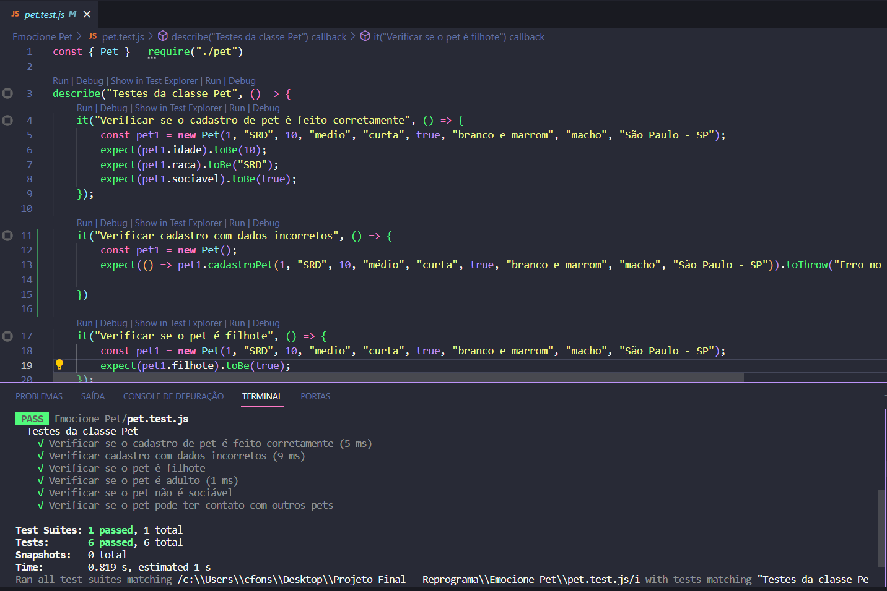
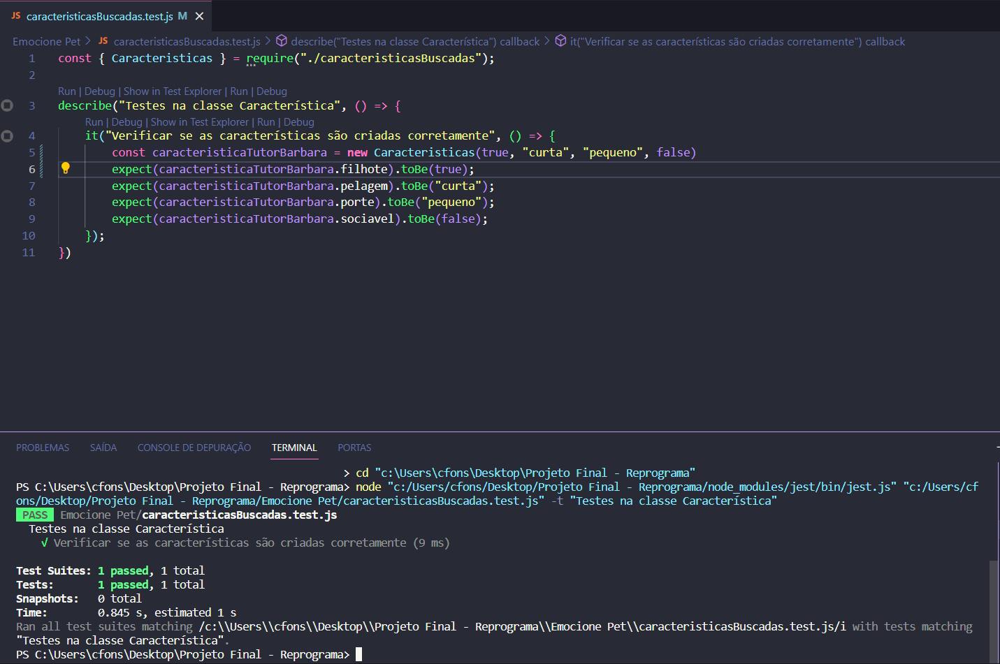
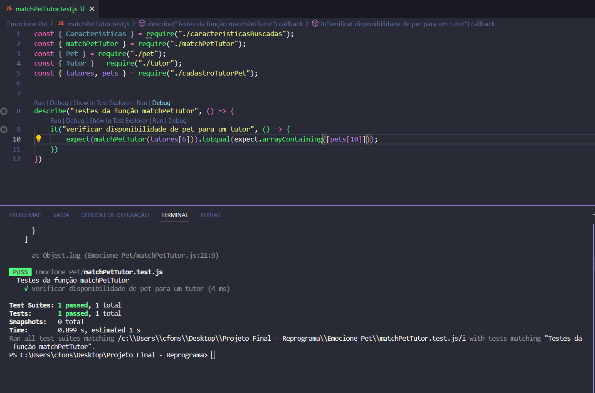

<h1 align="center">Sistema de adoção de pets - O match perfeito 🐾</h1>

<h1 align="center">PetAcolhe</h1>

</br>
<div align="center">
  
</div>
</br>

Projeto ODS 15 - FMU

# Introdução
Este projeto final está baseado em um dos objetivos de Desenvolvimento Sustentável no Brasil, qual seja: Vida Terrestre - ODS 15.

O PetAcolhe é um projeto criado com o propósito de reduzir a quantidade de animais em situação de abandono e incentivar a adoção responsável.

No Brasil, milhões de cães e gatos vivem nas ruas, enfrentando fome, frio, maus-tratos e doenças. Ao mesmo tempo, ONGs e protetores independentes lidam diariamente com a superlotação e a falta de recursos para resgatar e manter tantos animais.

O sistema surge como uma ferramenta de apoio para dar mais visibilidade a esses animais e facilitar o processo de adoção, contribuindo diretamente para:

    🐶 Diminuir o abandono, criando um canal de conexão entre animais e famílias;
    🐾 Apoiar ONGs e protetores, oferecendo um espaço para divulgar resgates e buscar adotantes; e
    💚 Conscientizar a comunidade sobre a importância da adoção e da guarda responsável.

Então, a proposta do sistema é criar um espaço digital que consiga aproximar tutores, protetores independetes e ONGs, ampliando a divulgação de animais resgatados e buscando reduzir o abandono de animais por meio de um "match" ideal entre tutor e pet.

É importante ressaltar que o projeto está alinhado principalmente à ODS 15 - Vida Terrestre, mas também abrange um pouco da ODS 11 - Cidades e Comunidades Sustentáveis, pois uma cidade sustentável é também aquela que acolhe e cuida de todos os seres vivos que nela habitam.


</br>


# Proposta do Projeto

Com base nisso, o presente projeto visa associar tutores que querem adotar pets e os animais que estão disponíveis para adoção, dando um "match" com base nas características buscadas pelos tutores.

O projeto abarca apenas os animais da espécie cachorro, sendo presumido que todos são vacinados, castrados e vermifugados antes da adoção.

A PetAcolhe é um sistema com os dados dos tutores e as características buscadas em um pet e as características dos pets que estão disponíveis para adoção, inclusive a localidade em que se encontram.


## Cadastro do Tutor

O tutor que está em busca de um pet irá fazer um cadastro, preenchendo os seus dados e as características que busca em um pet.

Primeiro será necessário informar as características desejadas, utilizando a classe Características, quanto às seguintes questões: 
- filhote ("true" ou "false");
- pelagem ("curta" ou "longa");
- porte ("pequeno", "médio" ou "grande"); 
- sociável (caso não tenha preferência, coloque "false");
- sexo (macho ou fêmea);

Depois, deverá criar seu cadastro utilizando a classe "Tutor", informando:

- nome;
- idade; 
- telefone;
- email;
- localidade;
- alergia a pelo;
- possui outros animais; (importante para definir se o pet deve ser sociável ou não)
- motivo da adoção;
- caracteristicas buscadas;


Por exemplo:

``````
const caracteristicaTutor1 = new Caracteristicas(true, "curta", "grande", true);

const tutor1 = new Tutor("Bárbara", 29, "61999885688", "barbara@fmu.com.br", "São Paulo - SP", false, true, "suporte emocional", caracteristicaTutor1);

``````

## Cadastro do Pet

O PetAcolhe contará com o cadastro dos animais que estão disponíveis para adoção. As informações necessárias são:

- número de identificação do pet;
- raça;
- idade;
- porte;
- pelagem;
- sociável;
- cor;
- sexo;
- localidade;
- filhote;

Por exemplo:

````
const pet1 = new Pet(1, "SRD", 10, "médio", "curta", true, "branco e marrom", "macho", "São Paulo - SP");
````
</br>

# Detalhes técnicos

O projeto foi desenvolvido com técnicas de testes unitários, visando minimizar o risco de eventuais bugs, bem como técnicas de Clean Code para facilitar a leitura do código.

As tecnologias utilizadas foram: JavaScript e Jest.

## Classes Utilizadas


### Tutor

Para fazer o cadastro do tutor.

Importante destacar que os tutores idosos não podem escolher filhotes, tendo em vista que eles possuem mais energia, e as pessoas alérgicas só podem escolher animais de pelo curto.

Isso tudo para evitar que os tutores se arrependam da adoção e devolvam os animais.


```
class Tutor {
    nome;
    idade;
    idoso;
    #telefone;
    email;
    localidade;
    alergiaAPelo;
    possuiOutrosAnimais;
    motivoAdocao;
    caracteristicasBuscadas;

    static tutoresCadastrados = [];

    constructor(nome, idade, telefone, email, localidade, alergiaAPelo, possuiOutrosAnimais, motivoAdocao, caracteristicas) {
        this.nome = nome;
        this.idade = idade;

        if(idade >= 60){
            this.idoso = true;

        } else{
            this.idoso = false;
        }
        
        this.#telefone = telefone;
        this.email = email;
        this.localidade = localidade;
        this.alergiaAPelo = alergiaAPelo;
        if(this.alergiaAPelo === true) {
            if(caracteristicas.pelagem !== curto){
                throw new Error("Não é indicado pets de pelo longo para pessoas alérgicas.")
            }
        };

        this.possuiOutrosAnimais = possuiOutrosAnimais;
        this.motivoAdocao = motivoAdocao 
        this.caracteristicasBuscadas = caracteristicas;

        if(idade >= 60){
            if(caracteristicas.idade < 12){
                throw new Error("Não é indicado pets filhotes para pessoas de 60 anos ou mais.")
            }
        }

        Tutor.tutoresCadastrados.push(this);
    }

    get telefone() {
        return this.#telefone;
    }

    set telefone(telefone) {
        this.#telefone = telefone;
    }
}
```

### Pet

Para fazer o cadastro dos pets disponíveis para adoção.

```
class Pet {
    idPet;
    raca;
    idade;
    porte;
    pelagem;
    sociavel;
    cor;
    sexo;
    localidade;
    filhote;

    static petsCadastrados = [];

    constructor(idPet, raca, idade, porte, pelagem, sociavel, cor, sexo, localidade){
        this.idPet = idPet;
        this.raca = raca;
        this.idade = idade;

        if(idade < 12){
            this.filhote = true;

        } else{
            this.filhote = false;
        }
        this.porte = porte;
        this.pelagem = pelagem;
        this.sociavel = sociavel;
        this.cor = cor;
        this.sexo = sexo;
        this.localidade = localidade;

        Pet.petsCadastrados.push(this)
    }

    
    cadastroPet(idPet, raca, idade, porte, pelagem, sociavel, cor, sexo, localidade) {
        if(Pet instanceof Pet) {
            this.idPet = idPet;
            this.raca = raca;
            this.idade = idade;
            this.porte = porte;
            this.pelagem = pelagem;
            this.sociavel = sociavel;
            this.cor = cor;
            this.sexo = sexo;
            this.localidade = localidade;
    
            return "Pet cadastrado";
        } else {
            throw new Error("Erro no cadastro, dados inválidos");
        }
    }

    contatoComOutrosPets() {
        if(this.sociavel === true) {
           return "Esse animal é sociável e pode ter contato com outros pets."
        } else {
            return "Esse animal NÃO é sociável. O ideal é que o Tutor não possua outros pets."
        }
    }
}

```

### Características

São as informações buscadas pelos tutores em um pet.

````
class Caracteristicas {
    filhote;
    pelagem; 
    porte;
    sociavel;

    
    static caracteristicasBuscadas = []

    constructor(filhote, pelagem, porte, sociavel) {
        this.filhote = filhote;
        this.pelagem = pelagem;
        this.porte = porte;
        this.sociavel = sociavel;

        Caracteristicas.caracteristicasBuscadas.push(this);
    }
}


````

## Como funciona o sistema?

Com base nas informações constantes nos cadastros dos tutores e dos pets, serão realizadas buscas de pets que estejam em conformidade com as características buscadas pelo tutor.

```
function matchPetTutor(tutor){
    let petsCadastradosFiltrados = Pet.petsCadastrados.filter(function (pet) {
        return pet.localidade === tutor.localidade &&
        pet.filhote === tutor.caracteristicasBuscadas.filhote &&
        pet.pelagem === tutor.caracteristicasBuscadas.pelagem &&
        pet.porte === tutor.caracteristicasBuscadas.porte &&
        pet.sociavel === tutor.caracteristicasBuscadas.sociavel
    }
    );

    return petsCadastradosFiltrados;
}

let listaFiltradaPets = matchPetTutor(tutores[0])
if(listaFiltradaPets.lenght === 0) {
    console.log("Não há animais disponíveis para adoção com as características informadas.")
}

```

## Testes Unitários

Foi utilizado o método de testes unitários para que fossem feitos testes em pequenas partes do sistema, evitando acúmulo de erros e dificuldade de consertá-los posteriormente.

Exemplo na classe Tutor:

</br>
<div align="center">
  
</div>
</br>

Exemplo na classe Pet:

</br>
<div align="center">
  
</div>
</br>

Exemplo na classe Caracteristicas:

</br>
<div align="center">
  
</div>
</br>

Exemplo na função matchPetTutor:

</br>
<div align="center">
  
</div>
</br>